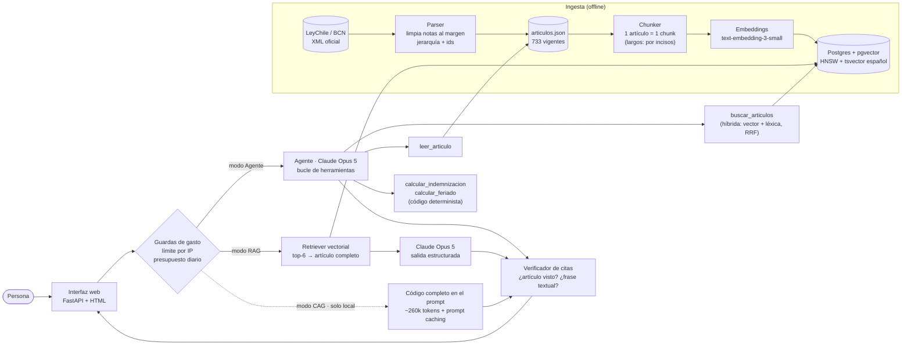

# ⚖️ LexLaboral — Asistente de IA sobre el Código del Trabajo de Chile

> Proyecto Final · AI Engineering · Autoría: **Gaby (GH)** · Rama de entrega: `finalproject-GH`
>
> 🌐 **Demo pública:** _pendiente de despliegue (ver [Despliegue](#despliegue))_

## El problema

En Chile, la mayoría de las dudas laborales del día a día ("¿cuántos días de vacaciones me
corresponden?", "¿me pueden despedir estando embarazada?", "¿cuánto me tienen que pagar si me
despiden?") tienen respuesta en el **Código del Trabajo**. Pero el Código tiene **737
artículos**, lenguaje jurídico y remisiones entre artículos. Una persona común no sabe dónde
buscar, y un chatbot genérico responde de memoria: no dice de dónde sale su respuesta y a veces
inventa, con cifras de leyes que ya cambiaron.

**LexLaboral** responde citando **el artículo exacto** que respalda cada afirmación y
**verifica automáticamente cada cita**: el artículo tuvo que estar en el contexto que vio el
modelo, y la frase citada tiene que aparecer textualmente en él. Si la ley no cubre la
pregunta, lo dice en vez de inventar.

| Resultado (golden set de 37 preguntas reales) | RAG | Agente |
|---|---|---|
| Citas verificadas (artículo visto + frase textual) | **100%** | 99,7% |
| Artículos correctos citados (recall) | 88% | **100%** |
| Preguntas fuera de alcance detectadas | 100% | 100% |
| Costo medio por pregunta | **US$0,07** | US$0,09 |

## Datos reales

| | |
|---|---|
| Fuente | [LeyChile — Biblioteca del Congreso Nacional](https://www.bcn.cl/leychile/navegar?idNorma=207436) (servicio oficial XML) |
| Norma | DFL 1 (2003), texto refundido del Código del Trabajo · `idNorma 207436` |
| Versión | 2026-07-23 (versionada en `data/raw/codigo_trabajo.xml` para reproducibilidad) |
| Tamaño | 737 artículos (733 vigentes, 4 derogados) · 822 chunks · jerarquía Libro › Título › Capítulo › Párrafo |

## Arquitectura



El sistema recorre las mismas capas del programa (CAG → RAG → agente → evals → despliegue),
y **las tres arquitecturas comparten prompt, esquema de salida y verificador**, así que los
evals comparan arquitecturas y no diferencias de prompt.

| Componente | Archivos |
|---|---|
| Ingesta y parser | `app/ingestion/parser.py`, `scripts/download_data.py` |
| CAG | `app/cag/service.py` |
| RAG: chunking, embeddings, pgvector, recuperación | `app/rag/`, `alembic/`, `scripts/ingest.py` |
| Generación con citas + verificación | `app/generation/`, `app/llm.py` |
| Agente y herramientas | `app/agent/` |
| Prompts versionados | `app/prompts/` (+ [`CHANGELOG.md`](app/prompts/CHANGELOG.md)) |
| API, interfaz y guardas de gasto | `app/main.py`, `app/static/index.html`, `app/guard.py` |
| Evals | `evals/golden_set.json`, `scripts/eval_*.py`, resultados en `evals/results/` |

## Decisiones técnicas (y la evidencia detrás)

### 0 · Ingesta
- **XML oficial y no scraping de HTML/PDF**: la BCN publica cada norma con estructura explícita
  (`EstructuraFuncional` con `tipoParte` = Libro/Título/Capítulo/Artículo). Parsearla es exacto;
  un PDF perdería la jerarquía y mezclaría columnas.
- **Limpieza de la columna de notas al margen**: el texto trae a la derecha referencias de
  modificación ("L. 18.620 / ART. PRIMERO"), ruido para embeddings y búsqueda léxica.
- **Ids estables por artículo** (`art-67`, `art-40-bis-a`, `art-t-1`): el artículo es la unidad
  de citación, igual que en la práctica jurídica.
- **Un bug real encontrado por el verificador**: en una prueba de la interfaz, el agente citó
  `art-183-ae` y el verificador lo marcó como "artículo no consultado". El modelo tenía razón: mi
  parser marcaba como *transitorios* los arts. 183-A a 183-AE porque su título dice "empresas de
  servicios **transitorios**". Corregido con test de regresión (`tests/test_parser.py`).

### 1 · CAG (baseline)
- **El Código completo cabe en contexto, pero solo en modelos de 1M tokens**: ~258k tokens en
  `claude-opus-5` (193k en Haiku 4.5, cuyo contexto de 200k no deja espacio útil).
- **Prompt caching**: instrucciones + Código forman un prefijo estable con `cache_control`; la
  pregunta va después del breakpoint.
- **Lo que enseñó la primera ejecución real** ([evals/cag_sample_output.md](evals/cag_sample_output.md)):
  calidad excelente (6/6 citas verificadas) pero ~US$3,7 la primera pregunta. El contexto medía
  367k tokens porque la ruta jerárquica se repetía en cada artículo (ahora se escribe una vez por
  sección) y el TTL de 1h cobra 2× la escritura (ahora TTL de 5 min, 1,25×).
- **Eval sobre 12 preguntas** ([answers_cag.jsonl](evals/results/answers_cag.jsonl)): 100% de
  citas verificadas y 100% de recall de artículos (en el mismo subconjunto, RAG 95,5% y agente
  100%). Costo: US$1,79 la primera pregunta (escritura de caché) y ~US$0,18 las siguientes con la
  caché caliente: **2-3× el agente y ~30× el RAG en la primera consulta**.
- **Conclusión**: CAG es una buena referencia de calidad, pero cada pregunta nueva paga ~260k
  tokens. En la demo pública está desactivado.

### 2 · RAG: chunking, embeddings, pgvector
- **Chunk = artículo**, sin tamaño fijo ni overlap. Los 106 artículos de más de 400 tokens se
  dividen **por incisos completos**: el cross-encoder solo lee ~512 tokens, y un vector de un
  artículo de 2.000 tokens "promedia" temas distintos.
- **Enriquecimiento contextual**: se embebe `ruta jerárquica + texto`. El art. 67 no dice
  "vacaciones", pero su capítulo se llama "Del feriado anual y de los permisos".
- **Small-to-big**: se busca por chunks, pero al LLM se le entrega el artículo completo (un
  inciso suelto puede perder la excepción del inciso de al lado).
- `text-embedding-3-small` (1536 dim), índice **HNSW** coseno, y `tsvector` en español generado
  por Postgres. Embeber el corpus completo cuesta ~US$0,005.

### 3 · Recuperación: la evidencia contradijo lo que funcionó en el curso
Golden set: [evals/golden_set.json](evals/golden_set.json), **37 preguntas en lenguaje
coloquial** (34 dentro del alcance y 3 fuera: AFP, licencia de conducir, Estatuto Docente),
anotadas a mano con los artículos que las responden, cada anotación y cada respuesta de
referencia verificada contra el texto de la ley. Métricas a nivel de artículo.
Detalle: [evals/results/retrieval.md](evals/results/retrieval.md).

| Config | Búsqueda | Reranking | hit@5 | recall@5 | MRR@5 | Latencia p50 |
|---|---|---|---|---|---|---|
| **A** | **Vectorial** | No | **0,94** | **0,87** | **0,74** | **12 ms** |
| B | Híbrida (RRF + filtro IDF) | No | 0,79 | 0,72 | 0,62 | 21 ms |
| C | Vectorial | Sí (50 cand.) | 0,94 | 0,84 | 0,67 | 11,1 s |
| D | Híbrida | Sí (50 cand.) | 0,88 | 0,78 | 0,64 | 14,0 s |
| E | Híbrida | Sí (20 cand.) | 0,91 | 0,82 | 0,69 | 5,7 s |

- **La búsqueda híbrida empeoró la recuperación.** Diagnóstico: la rama léxica sola acertaba
  solo el 26%, porque las personas preguntan con palabras que el Código no usa
  ("vacaciones"/feriado, "me echaron"/despido, "papá"/padre), y términos ubicuos ("trabajo",
  "días") dominaban el ranking. Un **filtro IDF** genérico (descartar lexemas presentes en >15%
  de los chunks) la subió a 44%, pero la híbrida siguió por debajo de la vectorial. No se
  ajustaron pesos mirando las mismas 34 preguntas, para no "sobreajustar al examen".
- **El reranker no mejoró nada y es ~1.000× más lento** (11 s vs 12 ms en CPU). El modelo
  `mmarco-mMiniLMv2` está entrenado con búsquedas web (MS MARCO), no con texto legal en español.
- **Decisión: el RAG usa búsqueda vectorial sin reranking.** Bonus: la imagen de producción no
  necesita PyTorch (~2 GB); el reranker queda en el grupo opcional `rerank`.

### 4 · Generación con citas verificables
- **Salida estructurada** (`messages.parse` + Pydantic, [`schemas.py`](app/generation/schemas.py)):
  respuesta corta + afirmaciones, cada una con `grounded` y citas `{article_id, quote}`. Un
  validador impide representar una afirmación "respaldada" sin citas.
- **Verificación más fuerte que en el curso** ([`citations.py`](app/generation/citations.py)): en
  el estimador se comprobaba que el `chunk_id` existiera; aquí además la **frase citada tiene que
  aparecer textualmente** en el artículo (tolerante a mayúsculas, espacios y comillas). Tres
  estados: ✓ verificada, ⚠ no textual (parafraseo), ✗ artículo no consultado.
- Es estricta a propósito: la única cita rechazada del agente en 37 respuestas fue un error de
  una letra ("expre**ss**ando" por "expresando"). En una cita legal, textual es textual.

### 5 · Agente
- **Por qué un agente además del RAG**: el RAG hace UNA búsqueda con las palabras del usuario.
  Si el artículo clave no aparece, no hay respuesta correcta posible ("quiero renunciar" no trajo
  el art. 159; "¿por qué me pueden despedir sin indemnización?" no trajo el art. 160). El agente
  **reformula al vocabulario del Código, busca por partes, sigue remisiones entre artículos y
  calcula**: recall de artículos 88% → **100%**, por +US$0,02 y +5 s por pregunta.
- **Herramientas** ([`tools.py`](app/agent/tools.py)): `buscar_articulos`, `leer_articulo`,
  `calcular_indemnizacion` (arts. 161-163 y 172: fracción superior a 6 meses, tope de 330 días y
  de 90 UF, aviso previo) y `calcular_feriado` (arts. 67-68, feriado progresivo). **Las
  calculadoras son código con tests**: el LLM decide qué regla aplica; la aritmética con fechas y
  topes, donde un LLM se equivoca en silencio, la hace código probado.
- **Bucle manual** en vez del Tool Runner del SDK para tener tope de pasos (en el último se
  prohíben herramientas), traza de cada llamada para los evals, y registro del texto legal que el
  agente realmente vio, contra el que se verifican sus citas.
- **La búsqueda híbrida sí sirve dentro del agente**: re-ejecutando las consultas que el agente
  escribió ([evals/results/agent_queries.md](evals/results/agent_queries.md)), recall 0,87
  (pregunta del usuario) → 0,91 (consultas del agente, vectorial) → **0,93 (consultas del
  agente, híbrida)**. Con vocabulario jurídico, la coincidencia exacta de términos ayuda. Por eso
  el agente usa híbrida y el RAG vectorial (diferencia pequeña con 34 preguntas; se declara así).
- La fecha de hoy va en el mensaje (no en el sistema, para no invalidar la caché): sin ella el
  agente no puede saber si un plazo legal ya venció.

### 6 · Evals
| Eval | Qué mide | Costo LLM | Script |
|---|---|---|---|
| Recuperación | hit/recall/MRR@5 y latencia de 5 configuraciones | $0 | `scripts/eval_retrieval.py` |
| End-to-end | citas verificadas, recall de artículos citados, fuera de alcance, costo, latencia | ~US$0,07-0,09/pregunta | `scripts/eval_answers.py` |
| Consultas del agente | vectorial vs híbrida con las consultas reformuladas | $0 | `scripts/eval_agent_queries.py` |
| RAGAS | faithfulness, answer relevancy, context precision/recall (juez gpt-4o-mini) | centavos | `scripts/eval_ragas.py` |
| Unitarios | parser, chunker, RRF, verificador, calculadoras | $0 | `uv run pytest` (27 tests) |

Resultados end-to-end ([answers_*.jsonl](evals/results/)):

| Sistema | Preguntas | Citas verificadas | Recall de artículos | Fuera de alcance | Costo medio | Latencia p50 |
|---|---|---|---|---|---|---|
| CAG | 12 (subconjunto) | 100% | 100% | 1/1 | US$0,31 (1,79 la 1ª · ~0,18 con caché) | 18,7 s |
| RAG | 37 | **100%** | 88,2% | 3/3 | **US$0,070** | **17,2 s** |
| Agente | 37 | 99,7% | **100%** | 3/3 | US$0,091 | 21,9 s |

**RAGAS** ([evals/results/ragas.md](evals/results/ragas.md)) — juez de otro proveedor (OpenAI)
que el generador (Claude), para no premiar el propio estilo:

{{RAGAS_TABLE}}

### Elección de modelo
`claude-opus-5` para generación y agente (configurable con `LLM_MODEL`), con salida
estructurada, pensamiento adaptativo, `effort=medium` y `fallbacks="default"` (si el
clasificador de seguridad rechazara una consulta sobre temas como acoso o violencia, la API
reintenta con otro modelo en la misma llamada). Embeddings y juez de RAGAS en OpenAI, igual que
en el curso.

### Prompts versionados
Cada prompt es un archivo (`app/prompts/<nombre>/<versión>.md`) y `loader.CURRENT` indica el
activo. El historial y su justificación están en [`app/prompts/CHANGELOG.md`](app/prompts/CHANGELOG.md).
Decisiones de redacción: explicar *por qué* (la ley cambia → no usar memoria) en vez de solo
prohibir; avisar que las citas se verifican; dar ejemplos del salto de vocabulario coloquial →
jurídico en el prompt del agente.

## Levantar localmente

Requisitos: [uv](https://docs.astral.sh/uv/), Docker, claves de OpenAI (embeddings) y Anthropic (generación).

```bash
cp .env.example .env                      # y rellena OPENAI_API_KEY / ANTHROPIC_API_KEY
uv sync                                   # dependencias
docker compose -p lexlaboral up -d        # Postgres 16 + pgvector (puerto 5434)
uv run alembic upgrade head               # esquema
uv run python -m app.ingestion.parser     # XML oficial -> data/processed/articulos.json
uv run python scripts/ingest.py           # chunks + embeddings -> pgvector (~US$0,005)
uv run uvicorn app.main:app --reload      # interfaz en http://localhost:8000 · API en /docs
uv run pytest -q                          # tests
```

Para probar el modo CAG localmente: `ENABLE_CAG=true` en `.env` (cuesta ~US$1,6 la primera
pregunta y ~US$0,2 las siguientes mientras la caché esté caliente).

## Despliegue

Render (blueprint en [`render.yaml`](render.yaml)): servicio web Docker + Postgres con pgvector.
Al arrancar, [`scripts/start.sh`](scripts/start.sh) aplica migraciones, ingesta el corpus solo si
la tabla está vacía, y levanta la API.

**Guardas de gasto** ([`app/guard.py`](app/guard.py)), porque cada consulta de la demo pública
gasta crédito real: máximo 10 consultas por IP por hora, presupuesto diario global (US$3 por
defecto; al superarlo responde 429) y CAG desactivado.

## Limitaciones conocidas y próximos pasos

| Limitación | Cómo resolverla |
|---|---|
| **Solo el Código del Trabajo.** Muchas dudas laborales dependen de otras normas (Ley 16.744 de accidentes, DL 3.500 de pensiones, Ley Karin, reglamentos) y de la jurisprudencia de la Dirección del Trabajo. | Añadir esas normas al corpus con el mismo parser (mismo formato XML de la BCN) y los dictámenes de la DT como segunda colección, con filtro por tipo de fuente. |
| **Golden set pequeño (37) y anotado por una sola persona.** Diferencias como híbrida 0,93 vs vectorial 0,91 no son concluyentes. | Ampliar a 150+ preguntas con consultas reales (foros, preguntas frecuentes de la DT), doble anotación y separar un conjunto de validación para ajustar parámetros sin tocar el de prueba. |
| **El corpus se desactualiza** cuando la ley cambia. | Tarea programada que descargue el XML, compare `fechaVersion` y reingeste solo los artículos modificados. |
| **Una sola pregunta, sin conversación.** El agente no pregunta los datos que faltan (fechas, sueldo): los declara como faltantes. | Modo conversacional con historial, donde el agente pueda pedir aclaraciones antes de calcular. |
| **El reranker probado no sirve en este dominio.** | Probar un reranker multilingüe más grande (`bge-reranker-v2-m3`) o reranking con LLM, midiéndolo con el mismo eval. |
| **Guardas de gasto en memoria**: no sirven con varias réplicas. | Moverlas a Postgres/Redis. |
| **La latencia del agente (~22 s)** es alta para chat. | Streaming de la respuesta y de los pasos del agente en la interfaz; `effort=low` para preguntas simples. |
| **Orientación, no asesoría.** El sistema no evalúa pruebas ni casos concretos. | Mantener el aviso visible y derivar (DT, Corporación de Asistencia Judicial) cuando `out_of_scope`. |

## ⚠️ Aviso

LexLaboral es un proyecto académico. Sus respuestas son orientativas y no reemplazan la
asesoría de un abogado ni de la Dirección del Trabajo.
